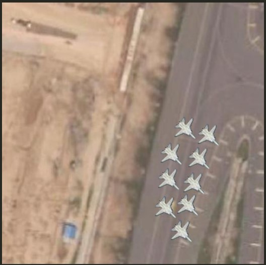

# Real Synthetic Dataset Generation Tool
 Real Synthetic Dataset Generation Tool

# 1. Introduction
This tool is used to generate synthetic datasets for the purpose of testing and benchmarking machine learning algorithms. The tool is written in Python and uses the [OpenCV](https://opencv.org/) library for data manipulation and [NumPy](https://numpy.org/) for numerical operations. The tool is designed to be used in a Python environment.

# 1.1. Workflow of the tool
Here is the self-explanatory workflow of the tool.


# 2. Installation

## 2.0. Pre-requisites
Prepare the data and extract Transparent Image Mask from this repository [Transparent Image Extraction using Mask](https://github.com/theshahzaib/Transparent-Image-Extraction-using-Mask.git) `(Pipeline-1)`

## 2.1. Requirements
The tool requires Python 3.7 or higher.

## 2.2. Required Libraries
```bash
pip install requirements.txt
```

## 2.3. Folder Hierarchy
```bash
├── Dataset
│
│   ├── background_images
│   │   ├── 1.jpg
│   │   ├── 2.jpg
│   │   ├── 3.jpg
│   
│   ├── input
│   │   ├── 0-class-0 [folder name starting with class number]
│   │   │   ├── 1.png
│   │   │   ├── 2.png
│   │   │   ├── 3.png
│   │   ├── 1-class-1
│   │   │   ├── 1.png
│   │   │   ├── 2.png
│   │   │   ├── 3.png
│   │   ├── 2-class-2
│   │   │   ├── 1.png
│   │   │   ├── 2.png
│   │   │   ├── 3.png
│   
│   ├── Dataset_output
│   │   ├── 1.jpg
│   │   ├── 1.txt
│   │   ├── 2.jpg
│   │   ├── 2.txt
│   │   ├── 3.jpg
│   │   ├── 3.txt
```


# 3. Usage
The tool is designed to be used in a Python environment. 

```bash
python setup.py
```

## 3.1 Object Selection GUI


## 3.2 Object Selected


## 3.3 Click on Base Image


## 3.4 Object Placed



## 3.5 Auto Generated Label files in YOLO format


# 4. License
This project is licensed under the Apache License 2.0 - see the [LICENSE](LICENSE) file for details.


